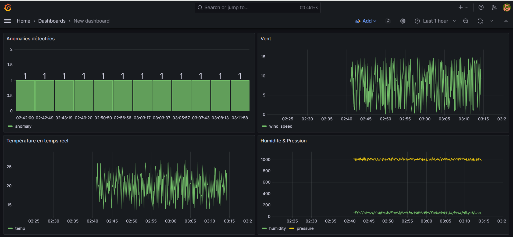

# 🌦️ Real-Time Weather Intelligence System  
Pipeline temps-réel complet : Kafka → Python → PostgreSQL → Grafana  
Détection d'anomalies météo en streaming avec IsolationForest.

---

# 🧩 1. Présentation du projet

Ce projet implémente un **pipeline de données en temps réel** capable de :

- Générer des données météo (simulateur Python)
- Streamer en continu via **Apache Kafka**
- Traiter et détecter des anomalies via **Python + IsolationForest**
- Stocker les données dans **PostgreSQL**
- Visualiser les données en temps réel dans **Grafana**

C’est un projet complet de **Data Engineering / Streaming / Machine Learning / Visualisation**.

---

# ⚙️ 2. Architecture du système

```mermaid
graph TD
    A[📊 Producer<br/>Données météo] --> B[🕸️ Kafka<br/>Topic: weather-data]
    B --> C[🐍 Consumer Python<br/>IsolationForest]
    C --> D[🗄️ PostgreSQL<br/>weatherdb.weather]
    D --> E[📈 Grafana<br/>Dashboard temps réel]

# 📁 3. Structure du repository
real-time-weather/
│
├── docker-compose.yml          # 🎛️ Orchestration Docker
├── requirements.txt            # 📦 Dépendances Python
├── README.md                   # 📄 Documentation
│
├── producer.py                 # 🔄 Générateur de données
├── consumer.py                 # 🤖 Traitement + ML
│
├── docker/
│   ├── producer/Dockerfile     # 🐳 Producer
│   └── consumer/Dockerfile     # 🐳 Consumer
│
├── sql/
│   └── init.sql                # 🗃️ Schéma PostgreSQL
│
└── grafana/
    └── dashboard.json          # 📊 Dashboard prêt

---

# 🚀 4. Lancement rapide

4.1. Démarrer les services

```bash
docker-compose build
docker-compose up -d

4.2. Initialiser la base PostgreSQL

    # 1. Cloner le repository
    git clone <votre-repository-url>
    cd real-time-weather

    # 2. Construire et démarrer tous les services
    docker-compose up -d --build

    # 3. Initialiser la base de données
    docker exec -it real-time-weather-postgres-1 \
    psql -U weather -d weatherdb -f sql/init.sql

    # 4. Vérifier les logs

    docker-compose logs -f producer
    docker-compose logs -f consumer

# 📊 5. Accès Grafana

👉 http://localhost:3000

Identifiants : admin / admin

Ajouter PostgreSQL :

Host : host.docker.internal:5432

Database : weatherdb

User : weather

Password : weatherpass

SSL : disable

Importer le dashboard :

→ Dashboard → Import → Upload grafana/dashboard.json

# 📊 Aperçu du Dashboard Grafana

Voici le tableau de bord temps réel :




# 🔍 6. Vérifier les données PostgreSQL
SELECT COUNT(*) FROM weather;
SELECT * FROM weather WHERE anomaly = TRUE;

# 🧠 7. Détection d’anomalies

Modèle utilisé : IsolationForest
Variables analysées :

    température

    humidité

    pression

    vent

Les anomalies sont marquées TRUE dans la base puis affichées dans Grafana.

# 🛠️ 8. Développement local (optionnel)

python -m venv venv
venv/Scripts/activate
pip install -r requirements.txt

python consumer.py
python producer.py

# 🧱 9. Technologies utilisées

Apache Kafka

Python 3.10

scikit-learn

pandas / numpy

PostgreSQL

Grafana

Docker et Docker Compose

# 🚀 10. Améliorations possibles

OpenWeather API (temps réel réel)

Alerting Grafana Slack/Email

Prometheus + Loki

Modèles ML temporels (LSTM Autoencoder)

Déploiement cloud (AWS / DigitalOcean)


# 📘 11. English Version
Real-Time Weather Intelligence System

A full real-time data pipeline that:

Streams weather data with Kafka

Processes anomalies with Python & IsolationForest

Stores data in PostgreSQL

Visualizes metrics in Grafana

Quick start
   docker-compose up -d --build
    docker exec -it real-time-weather-postgres-1 psql -U weather -d weatherdb -f sql/init.sql

Grafana : http://localhost:3000  (admin/admin)

